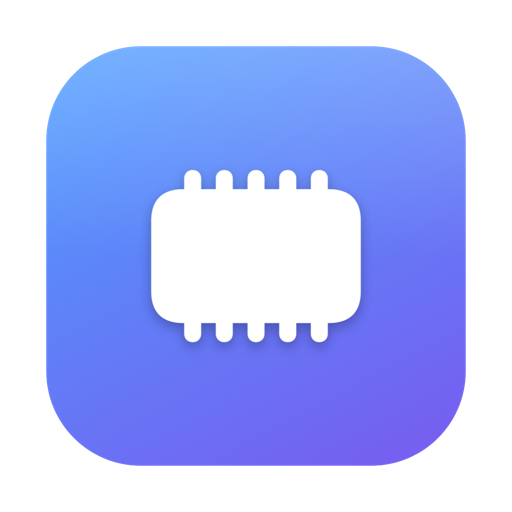

<div align="center">



# MemoryButler

**A smart memory butler for low-RAM Macs — it watches, decides, and frees memory on its own, so your 8GB Mac stays smooth.**

**English** | [简体中文](README.zh-CN.md) | [繁體中文](README.zh-TW.md)


[](https://github.com/xiewei3536/MemeryButler/releases/latest)


</div>

---

## Why

Macs with 8GB of RAM spend a lot of time swapping and compressing memory, and everything feels sluggish. MemoryButler is a tiny native menu bar app that monitors memory pressure in real time and **automatically frees memory at the right moment** — no clicking required, no root password, no Electron bloat (it idles at ~35MB itself).

## Features

- 🧠 **Smart autonomous release** with three configurable triggers:
  1. **Kernel pressure signal** — reacts the instant macOS reports memory pressure
  2. **Low-available threshold** — available memory below 12% (adjustable) for 30 seconds
  3. **Schedule** — every 15 min to 2 hours, if you prefer a fixed rhythm
- 📈 **Adaptive cooldown** — if a release reclaims little (system genuinely busy), it backs off automatically instead of thrashing; big wins restore the normal pace
- 🔋 **Considerate guards** — pauses in Low Power Mode, brakes immediately at critical pressure, keeps a 300MB safety floor
- 🎛 **Polished native UI** — pressure ring gauge, App/Wired/Compressed/Cached breakdown, a live 5-minute usage chart with hover readout, and a full release history log
- 📊 **Menu bar at a glance** — live usage percentage right in your menu bar
- 🚀 **Universal Binary** — one app for both Intel and Apple Silicon, launch-at-login supported

## Install

1. Download `MemoryButler.dmg` from the [latest release](https://github.com/xiewei3536/MemeryButler/releases/latest)
2. Open it and drag **MemoryButler** into **Applications**
3. First launch: **right-click the app → Open** (it is ad-hoc signed, so Gatekeeper asks once)
4. Look for the chip icon in your menu bar — that's your butler on duty

## How it works

MemoryButler requests large amounts of anonymous memory from the kernel at a controlled rate and touches every page, which compels XNU to immediately reclaim idle pages, compress inactive apps, and drop purgeable caches. It then returns everything at once, leaving the system with far more genuinely free memory. Entirely root-free, with hard safety limits: a free-memory floor, a critical-pressure brake, and total/time caps.

## Build from source

```bash
git clone https://github.com/xiewei3536/MemeryButler.git
cd MemeryButler
./build.sh   # produces dist/MemoryButler.app and dist/MemoryButler.dmg
```

Requirements: macOS 13+, Xcode Command Line Tools (Swift 5.9+).

## License

[MIT](LICENSE)
